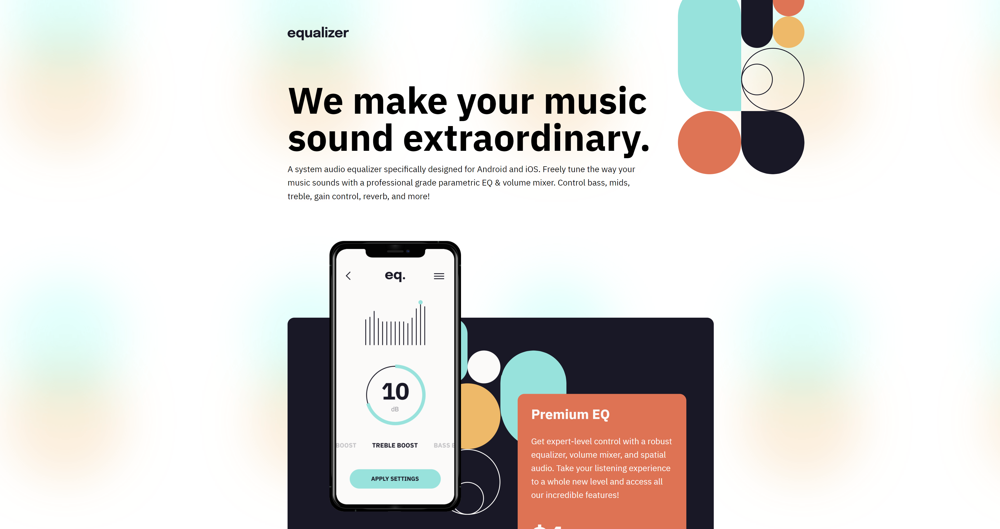

# Frontend Mentor - Equalizer landing page solution

This is a solution to the [Equalizer landing page challenge on Frontend Mentor](https://www.frontendmentor.io/challenges/equalizer-landing-page-7VJ4gp3DE). Frontend Mentor challenges help you improve your coding skills by building realistic projects.

## Table of contents

- [Overview](#overview)
  - [The challenge](#the-challenge)
  - [Screenshot](#screenshot)
  - [Links](#links)
- [My process](#my-process)
  - [Built with](#built-with)
  - [What I learned](#what-i-learned)
  - [Continued development](#continued-development)
  - [Useful resources](#useful-resources)
- [Author](#author)
- [Acknowledgments](#acknowledgments)


## Overview

### The challenge

Users should be able to:

- View the optimal layout depending on their device's screen size
- See hover states for interactive elements

### Screenshot




### Links

- Solution URL: [Here](https://github.com/Lfrancos/equalizer-landing-page)
- Live Site URL: [Here](https://lfrancos.github.io/equalizer-landing-page/)

## My process

### Built with

- Semantic HTML5 markup
- CSS custom properties
- Flexbox
- CSS Grid
- Mobile-first workflow


### What I learned

This has been an interesting exercise, thanks to @grace-snow I was able to take a look at the way I was creating my css, I was getting used to a way that is not the best because I was selecting every single thing instead of taking advantage of making it a little bit more global.
Also I'm not sure if what I did was good or not but I started to use max-width making it easier to keep the design that was intended. This way when people changes the width of the page they won't get unwanted design. Up until this moment of my learning I feel like this could be a really interesting solution for responsive sites.

### Continued development

Want to make sure that the way I'm using "scss" is the most optimized way to do it. I know there are a lot of things that I'm not doing in the right way and the way that I'm using it is the most basic, I need to start adding a little bit mor complexity and seeing how it could help me make it better.

```
I have not been able to set up the footer to work as the design. At first I thought it was supposed to be a flex, now I'm thinking it needs to be a grid. But still not sure if that is the best idea.
```

```
In any of the challenges up to this moment I have been able to edit the svg images, I know that I should be able to control the color from the css but I haven't figure out how to do that. - It ended up working, not perfectly but is working in a way.
```
```
Also something that was mentioned by @grace-snow but that I haven't payed to much attention is the "aria" tags, they are for accessibility.
I know how important that is but I want to spend a little bit more time feeling a more comfortable with the things that I'm learning so that I don't add to many things and start forgetting everything.
I have to build upon good structures.
```
```
Also something that I want to start doing but I haven't tried is to add gifs to the documentation. That can help make this "README" file more interesting.
```

### Useful resources

For this exercise I did not use any resources, witch makes me proud in a way since I was able to create this with out any help : )

## Author

- Website - [@lorenzo.francos](https://www.lorenzofrancos.com)
- Instagram - [@lorenzo.francos](https://www.instagram.com/lorenzo.francos/?hl=en)
- Github - [@Lfrancos](https://github.com/Lfrancos)
- Frontend Mentor - [@Lfrancos](https://www.frontendmentor.io/profile/Lfrancos)


## Acknowledgments

I really want to thank [@grace-snow](https://www.frontendmentor.io/profile/grace-snow) because her feedback has made me conscious of the way I'm approaching my "scss" and I'm sure that it is going to help me in the future.
